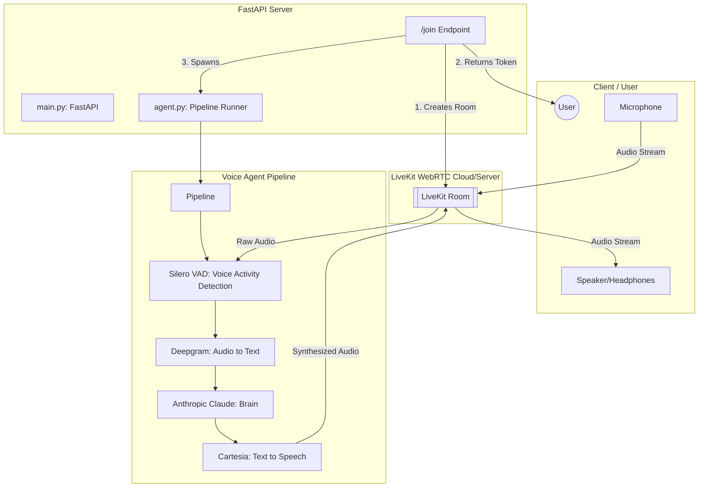

playing with claude
here is the architecture and tech stack for the **Talk2Me** voice agent.

### **Architecture Schema**

The system follows a real-time, streaming pipeline architecture where audio and text data flow through specialized micro-services coordinated by **Pipecat**.

---
Vercel handles the FastAPI deployment, environment variables, and the /join handshake.

### **Tech Stack Breakdown**

| Layer | Technology | Component in Code |
| :--- | :--- | :--- |
| **Orchestration** | **Pipecat** | Used to manage the asynchronous flow between STT, LLM, and TTS. |
| **API Framework** | **FastAPI** | Handles the `/join` request and triggers the agent task. |
| **Real-time Transport** | **LiveKit** | Provides the WebRTC infrastructure for low-latency audio streaming. |
| **Speech-to-Text (STT)** | **Deepgram (Nova-3)** | Transcribes incoming audio into text in real-time. |
| **Intelligence (LLM)** | **Anthropic (Claude)** | Processes text and generates conversational responses. |
| **Voice Activity (VAD)** | **Silero VAD** | Detects when a user starts or stops speaking to manage "barge-in". |
| **Text-to-Speech (TTS)** | **Cartesia (Sonic-2)** | Generates high-speed, low-latency synthesized speech. |
| **Environment** | **Python Dotenv** | Manages API keys for Anthropic, Deepgram, Cartesia, and LiveKit. |

### **Execution Flow**
1.  **Request**: A user hits the `/join` endpoint.
2.  **Setup**: The backend creates a LiveKit room and generates an access token for the user.
3.  **Agent Activation**: The `start_agent` task launches the Pipecat pipeline inside the same LiveKit room.
4.  **Loop**: 
    * **Input**: User speaks $\rightarrow$ **Silero** detects speech $\rightarrow$ **Deepgram** transcribes it.
    * **Brain**: **Claude** receives the text and generates a response based on the `SYSTEM_PROMPT`.
    * **Output**: **Cartesia** converts the response to audio and streams it back to the user via **LiveKit**.
